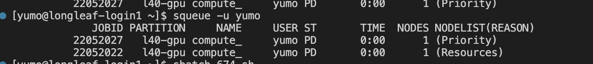

```{r setup, include=FALSE}
knitr::opts_chunk$set(echo = TRUE, eval = FALSE)
```

# Overview

This homework will test your knowledge of version control with
Git/GitHub, containerization with Docker, and high-performance computing
with Apptainer and Slurm. You will:

1.  Answer conceptual questions about Git and GitHub
2.  **Create a GitHub repository and version control your Docker image
    build process (with branching and merging)**
3.  Build a Docker image for the Linux environment and push it to Docker
    Hub
4.  Download and run the image on Longleaf using Apptainer and Slurm

**Note:** You may be working on macOS or Windows, but you'll be building
Linux containers that will run on Longleaf's Linux HPC environment.

**Total Points: 100**

**Important:** You will need to submit: - A PDF/HTML version of this
completed Rmd file with your answers - A link to your GitHub
repository - A link to your Docker Hub image - Your Slurm job script -
Screenshot/output of your Slurm job completion

------------------------------------------------------------------------

# Part 1: Git and GitHub Concepts (20 points)

## Question 1.1: Understanding Commits (5 points)

**a)** (3 points) What does a commit do in Git? Explain what information
is stored in a commit.

**Answer:**

A commit in Git saves a snapshot of your project at a specific point in
time. It records the exact state of all tracked files and documents how
the project changed. A commit stores the contents of the files, the
commit message, the author’s name and email, the date and time of the
commit, a unique commit hash, and references to the parent commit(s).
This information allows Git to keep a complete and traceable history of
the project.

**b)** (2 points) Why is it important to write descriptive commit
messages? Provide an example of a good commit message and a bad commit
message.

**Answer:**

Descriptive commit messages are important because they make it easier to
understand what changes were made and why they were made. Clear messages
help collaborators review work, identify when bugs were introduced, and
maintain the project over time. A good commit message is: “Fix
off-by-one error in data-parsing loop that caused incorrect indexing.” A
bad commit message is: “Update stuff” or “Fix code.”

## Question 1.2: Branching in Git (10 points)

**a)** (5 points) Explain how branching works in Git. What happens when
you create a new branch? What command would you use to create a new
branch called `feature-analysis` and switch to it?

**Answer:**

Branching in Git creates a new movable pointer to a specific commit.
When you create a new branch, Git does not copy files or duplicate the
project. Instead, it simply creates a new name that points to the
current commit. When you switch to that branch, Git updates HEAD so that
future commits will move that branch pointer forward. To create and
switch to a branch called `feature-analysis`, you would use:

`git checkout -b feature-analysis`

**b)** (5 points) Git branching is often described as "super
lightweight" compared to other version control systems. Explain why Git
branching is lightweight. (Hint: Think about how Git stores branches and
what happens under the hood when you create a branch.)

**Answer:**

Git branching is lightweight because a branch is just a simple pointer
to a commit rather than a full copy of the project. Creating a branch
only creates a small text file that stores the hash of a commit, which
means it requires almost no storage and is nearly instantaneous. When
you make new commits, Git only moves the pointer rather than duplicating
data. This is why Git can create, delete, and switch branches very
quickly compared to older version control systems that required copying
entire directories.

## Question 1.3: Merging Branches (5 points)

**a)** (3 points) What is the purpose of merging branches? Describe the
steps you would take to merge a branch called `feature-analysis` into
the `main` branch.

**Answer:**

The purpose of merging branches is to bring the changes from one branch
into another so that all work becomes part of a single unified project
history. Merging combines the commits from the feature branch with the
commits on the main branch. To merge a branch called `feature-analysis`
into `main`, you would first switch to the main branch with
`git checkout main` (or `git switch main`), and then run
`git merge feature-analysis` to integrate the changes.

**b)** (2 points) What is a merge conflict and when does it occur?

**Answer:**

A merge conflict occurs when Git cannot automatically combine changes
because the same part of a file was edited differently on two branches.
Git does not know which version is correct, so it stops the merge and
asks the user to manually resolve the conflicting sections. Conflicts
typically occur when multiple people modify the same lines of code or
when changes overlap in an incompatible way.

------------------------------------------------------------------------

# Part 2: Docker Image Creation and Deployment with Version Control (50 points)

In this section, you will create a Docker image that can run the
`compute_bench.py` script (which you used in Homework 2), which
benchmarks CPU/GPU performance using PyTorch. **You will version control
the entire process using Git and GitHub, practicing branching and
merging workflows.**

**Important Note on Operating Systems:** You may be working on macOS or
Windows, but Docker containers run Linux by default. You will be
building a **Linux-based container** that will run on Longleaf (which is
also Linux). Docker handles the cross-platform compatibility
automatically, so your Linux container built on macOS/Windows will work
seamlessly on Longleaf's Linux environment.

## Question 2.0: GitHub Repository Setup (5 points)

Before building your Docker image, you will set up version control for
your project.

**a)** (1 points) Create a new GitHub repository called
`stor674-homework5` (or similar name). Initialize it with a README.
Provide the GitHub repository URL.

**GitHub Repository URL:**

<https://github.com/baiyumo2003/stor674-homework5>

**b)** (2 points) Clone the repository to your local machine, add the
provided files (`compute_bench.py`, this `Homework5.Rmd`), and make your
initial commit. What commands did you use?

**Answer:**

``` bash
# Commands you used


git clone https://github.com/your-username/stor674-homework5
cd stor674-homework5
git add compute_bench.py Homework5.Rmd
git commit -m "Initial commit with homework files"
git push origin main
```

**c)** (2 points) Create a new branch called `docker-build` where you
will develop your Dockerfile. What command did you use? Why is it good
practice to use a separate branch for development instead of working
directly on `main`?

**Answer:**

``` bash
# Command to create and switch to branch

git checkout -b docker-build
```

**Explanation:**

It is good practice to use a separate branch for development because it
allows you to work on new features or changes without affecting the
stable `main` branch. This prevents unfinished or broken code from being
added to the main codebase, makes collaboration easier, and allows you
to test and review changes before merging them back into `main`.

## Question 2.1: Understanding compute_bench.py (5 points)

**a)** (3 points) Read the `compute_bench.py` script. What does this
script do? What is its main purpose?

**Answer:**

The `compute_bench.py` script benchmarks computation speed using PyTorch
on both the CPU and GPU. Its main purpose is to generate large random
tensors, perform a simple computation (`x = torch.randn(n) ** 4`), and
measure how long the operation takes on each device. It prints timing
results for different input sizes, generates a small sample of random
numbers, and saves the sample to a file called `mydata.pt`.

**b)** (2 points) What Python packages does `compute_bench.py` require?

**Answer:**

torch and time. However time is built in so only need to install torch

## Question 2.2: Create a Dockerfile (10 points)

Create a Dockerfile that: - Uses an appropriate **Linux-based** base
image with Python 3.9 or later - Installs the required Python packages
(PyTorch with CUDA support for GPU computing) - Copies
`compute_bench.py` into the container - Sets the default command to run
the script

**Important Considerations:**

-   **Operating System**: Even if you're on macOS or Windows, Docker
    will build a Linux container. Use Linux base images (e.g.,
    `python:3.9-slim` is based on Debian Linux).

-   **CUDA Support**: Longleaf has NVIDIA GPUs. To enable GPU support in
    your container:

    -   Option 1: Use official PyTorch image with CUDA:
        `pytorch/pytorch:2.0.0-cuda11.7-cudnn8-runtime`
    -   Option 2: Install PyTorch with CUDA support:
        `pip install torch torchvision --index-url https://download.pytorch.org/whl/cu118`
    -   Note: The container itself doesn't need NVIDIA drivers (Longleaf
        provides those), but PyTorch needs to be CUDA-aware.

-   **Testing Locally**: If your computer doesn't have an NVIDIA GPU,
    the container will still build and run (it will just use CPU). On
    Longleaf with GPU nodes, it will automatically detect and use the
    GPU.

**Instructions:**

1.  Make sure you're on the `docker-build` branch
2.  Create a file named `Dockerfile` in your repository
3.  Write the Dockerfile content below:

``` dockerfile
# Paste your Dockerfile content here

# Start from a Python base image
FROM python:3.9-slim

# Set the working directory
WORKDIR /app

# Copy your script into the container
COPY compute_bench.py .

# Install required packages
RUN pip install torch torchvision

# Run the script by default
CMD ["python", "compute_bench.py"]

```

**Grading Criteria:** - Appropriate Linux base image selection (2
points) - CUDA-enabled PyTorch installation (4 points) - Proper file
copying (2 points) - Correct CMD or ENTRYPOINT (2 points)

## Question 2.3: Build and Test Docker Image (10 points)

**a)** (3 points) What command did you use to build your Docker image?
Include the full command and explain each part.

**Answer:**

``` bash
# Your command here
docker build -t myimage .
docker run --rm myimage
```

**Explanation:**

`docker build` — tells Docker to build an image.

`-t myimage` — assigns the name (tag) **myimage** to the image so it can
be run later.

`.` — tells Docker to use the current directory as the build context
(this directory must contain your Dockerfile).

**b)** (4 points) What command did you use to run your Docker image
locally to test it? Include the output you received.

**Answer:**

``` bash
# Your command here
docker run --rm myimage
```

**Output:**

```         
# Paste the output here
No GPU available, running on CPU only

CPU Computations:
Time for 10,000,000 elements: 0.1147 seconds
Time for 100,000,000 elements: 1.2490 seconds

Small sample of 10 random numbers:
tensor([-0.1326, -1.5500,  1.1859,  1.5597,  0.7008, -0.4011, -1.1648,  0.1153,
        -0.3273, -0.3363])

Saved data to mydata.pt
```

**c)** (3 points) Were there any issues you encountered during the build
or test? How did you resolve them?

**Answer:**

During the build and test process, I encountered an issue where the
script saved the output file (`mydata.pt`) inside the Docker container
instead of on my local machine. This made it seem like the file
“disappeared” after the container finished running. I resolved this by
running the container with a mounted volume (`-v $(pwd):/app`), which
allowed the file created inside the container to be written directly to
my local directory. After mounting the volume, the script ran correctly
and the output file appeared on my machine.

## Question 2.4: Version Control Your Docker Build (10 points)

Now that you have a working Dockerfile, let's commit it and merge it
into the main branch.

**a)** (3 points) On your `docker-build` branch, add and commit your
Dockerfile with a descriptive commit message. What commands did you use?

**Answer:**

``` bash
# Commands to add and commit Dockerfile

git add Dockerfile
git commit -m "Add Dockerfile for computing benchmark container"
```

**b)** (4 points) Switch to the `main` branch and merge the
`docker-build` branch into it. What commands did you use? Paste the
merge message or output.

**Answer:**

``` bash
# Commands to switch branch and merge


```

**Merge Output:**

```         
# Paste merge output here
git merge docker-build
Updating 9d09bb8..9eb671c
Fast-forward
 dockerfile | 14 ++++++++++++++
 1 file changed, 14 insertions(+)
 create mode 100644 dockerfile
```

**c)** (3 points) Push your changes to GitHub. Verify that your
repository now contains the Dockerfile on the main branch. What command
did you use to push?

**Answer:**

``` bash
# Command to push to GitHub

git push origin main
```

**Verification:** Visit your GitHub repository in a web browser and
confirm the Dockerfile is visible. ✓

## Question 2.5: Push to Docker Hub (10 points)

**a)** (3 points) Create a Docker Hub account (if you don't have one)
and provide your Docker Hub username.

**Docker Hub Username:**

bryce314

**b)** (4 points) Tag your image appropriately and push it to Docker
Hub. What commands did you use?

**Answer:**

``` bash
# Commands you used
docker tag myimage bryce314/myimage:latest
docker push bryce314/myimage:latest

To mitigate the problem about arm abd amd I used the ACtion on github to get the docker imgae for the longleaf system.
```

**c)** (3 points) Provide the full Docker Hub image URL/name that others
can use to pull your image.

**Image URL:**

```         
# Format: username/imagename:tag
https://hub.docker.com/r/bryce314/myimage

docker://bryce314/stor674:latest
```

------------------------------------------------------------------------

# Part 3: Apptainer and Slurm on Longleaf (30 points)

In this section, you will download your Docker image using Apptainer on
UNC's Longleaf cluster and submit a job using Slurm. Remember: your
Linux container built on macOS/Windows will run seamlessly on Longleaf's
Linux environment.

## Question 3.1: Understanding Apptainer (5 points)

**a)** (3 points) What is Apptainer (formerly Singularity) and why is it
used on HPC systems instead of Docker?

**Answer:**

Apptainer (formerly called Singularity) is a container system designed
specifically for high-performance computing (HPC) environments. It is
used instead of Docker on HPC systems because it is more secure: it does
not require root privileges to run containers, and it prevents users
from gaining elevated permissions on shared systems. HPC clusters use
Apptainer because it is safer for multi-user environments, integrates
well with job schedulers, and supports running containers without
allowing users to modify the host system.

**b)** (2 points) What does "Bring Your Own Environment" (BYOE) mean in
the context of HPC and containers?

**Answer:**

“Bring Your Own Environment” (BYOE) means that users can package their
entire software environment—including libraries, dependencies, and
executables—inside a container and run it on an HPC system exactly the
same way they run it locally. This ensures reproducibility and removes
dependency conflicts because each user’s environment is isolated inside
their own container.

## Question 3.2: Convert Docker Image to Apptainer (10 points)

**a)** (5 points) Log into Longleaf and use Apptainer to pull your
Docker image from Docker Hub. What command did you use?

**Answer:**

``` bash
# Command to pull/convert Docker image to Apptainer
module load apptainer
apptainer pull stor674.sif docker://bryce314/stor674:latest

```

**b)** (3 points) What is the name of the Apptainer image file (.sif)
that was created?

**Answer:**

```         
# Filename here

stor674.sif
```

**c)** (2 points) Test your Apptainer image interactively. What command
did you use to run it?

**Answer:**

``` bash
# Command to run Apptainer image
apptainer shell stor674.sif
```

## Question 3.3: Create Slurm Job Script (12 points)

Create a Slurm job script that runs your containerized
`compute_bench.py` using Apptainer.

**Hint:** If you want to test with GPU support on Longleaf, you'll need
to: - Request a GPU partition (e.g., `#SBATCH -p gpu`) - Request GPU
resources (e.g., `#SBATCH --gres=gpu:1`) - Your CUDA-enabled PyTorch in
the container will automatically use the GPU!

**Instructions:**

1.  Create a file named `run_compute_bench.sh` in your GitHub repository
2.  Include appropriate Slurm directives (partition, time, memory, etc.)
3.  Load necessary modules (if needed)
4.  Run the Apptainer container

**Your Slurm Script:**

``` bash
#!/bin/bash
#SBATCH -n 1                         # number of tasks
#SBATCH -c 1                        # number of CPU cores
#SBATCH -t 1:00:00                   # walltime (1 hour)
#SBATCH --mem=10G                    # total memory
#SBATCH -p l40-gpu             # GPU partition
#SBATCH --qos=gpu_access             # QoS for GPU use
#SBATCH --gres=gpu:1    # request one GPU
#SBATCH -J compute_bench_job         # job name
#SBATCH -o compute_bench_%j.out      # standard output file
#SBATCH -e compute_bench_%j.err      # standard error file

# --- Environment setup ---
module purge
module load apptainer                
module load cuda/12.6                # load CUDA if needed for GPU

# --- Diagnostics ---
echo "Running on host: $(hostname)"
echo "CUDA devices available:"
nvidia-smi
echo "----------------------------------"

# --- Run your containerized script ---
# Example: assuming your image is compute_bench.sif
apptainer exec --nv stor674.sif \
    python /app/compute_bench.py

# --- Done ---
echo "Job completed at: $(date)"


```

**Grading Criteria:** - Appropriate Slurm directives (#SBATCH) (4
points) - Correct Apptainer run command (6 points) - Output redirection
and job organization (2 points)

## Question 3.4: Submit, Verify, and Version Control (3 points)

**a)** (1 point) What command did you use to submit your job to Slurm?

**Answer:**

``` bash
# Command here
sbatch run_compute_bench.sh
```

**b)** (2 points) Provide the output of your job. Paste the contents of
your Slurm output file (e.g., `slurm-jobid.out`). Also, add your Slurm
script (`run_compute_bench.sh`) to your GitHub repository and push it.

**Job Output:**

```         
# Paste your job output here


Running on host: g181004.ll.unc.edu
CUDA devices available:
Fri Nov 14 22:43:46 2025       
+-----------------------------------------------------------------------------------------+
| NVIDIA-SMI 575.57.08              Driver Version: 575.57.08      CUDA Version: 12.9     |
|-----------------------------------------+------------------------+----------------------+
| GPU  Name                 Persistence-M | Bus-Id          Disp.A | Volatile Uncorr. ECC |
| Fan  Temp   Perf          Pwr:Usage/Cap |           Memory-Usage | GPU-Util  Compute M. |
|                                         |                        |               MIG M. |
|=========================================+========================+======================|
|   0  NVIDIA L40S                    On  |   00000000:1A:00.0 Off |                    0 |
| N/A   31C    P8             61W /  350W |       0MiB /  46068MiB |      0%      Default |
|                                         |                        |                  N/A |
+-----------------------------------------+------------------------+----------------------+
                                                                                         
+-----------------------------------------------------------------------------------------+
| Processes:                                                                              |
|  GPU   GI   CI              PID   Type   Process name                        GPU Memory |
|        ID   ID                                                               Usage      |
|=========================================================================================|
|  No running processes found                                                             |
+-----------------------------------------------------------------------------------------+
----------------------------------
GPU available: NVIDIA L40S

CPU Computations:
Time for 10,000,000 elements: 0.1134 seconds
Time for 100,000,000 elements: 0.8066 seconds

GPU Computations:
Time for 10,000,000 elements: 0.1859 seconds
Time for 100,000,000 elements: 0.0026 seconds

Small sample of 10 random numbers:
tensor([ 0.3367,  0.1288,  0.2345,  0.2303, -1.1229, -0.1863,  2.2082, -0.6380,
         0.4617,  0.2674])

Saved data to mydata.pt
Job completed at: Fri Nov 14 10:43:54 PM EST 2025


```

**GitHub Verification:** ✓ Pushed `run_compute_bench.sh` to repository

**c)** (BONUS: +2 points) Include a screenshot showing your job in the
Slurm queue or completed job information using `squeue` or `sacct`. Also
show that your job successfully utilized a GPU (if you requested one).



------------------------------------------------------------------------

# Part 4: Reflection and Best Practices (Optional - Extra Credit: 5 points)

**Question 4.1:** Reflect on the workflow you just completed (Git →
Docker → HPC). How does this approach improve reproducibility in
computational research? What are some advantages and potential
challenges?

**Answer:**

The Git → Docker → HPC workflow improves reproducibility by keeping
code, environment, and data consistent across systems. Using Git tracks
all code changes and versions. Docker (or Apptainer) packages the entire
software environment, including dependencies, so that the same container
can be run anywhere without setup differences. Running it on an HPC
ensures scalable and reliable computation on powerful hardware.

Advantages include consistent results, easier collaboration, and
simplified sharing and verification of experiments. Potential challenges
include the learning curve of container tools, managing large images,
and handling differences between Docker and Apptainer. Overall, this
workflow ensures transparency, repeatability, and reliability in
computational research.

------------------------------------------------------------------------

# Submission Checklist

Before submitting, make sure you have:

-   [x] Completed all questions in Part 1 (Git/GitHub concepts)
-   [x] **Created a GitHub repository with all your project files**
-   [x] **Practiced branching and merging in your Git workflow**
-   [x] Created a Dockerfile with CUDA support for GPU computing
-   [x] Built and tested your Docker image locally (Linux container on
    macOS/Windows)
-   [x] Pushed your image to Docker Hub
-   [x] Provided your Docker Hub image URL
-   [x] Created a Slurm job script
-   [x] Successfully ran your job on Longleaf
-   [x] **Pushed all files (Dockerfile, Slurm script, completed Rmd) to
    GitHub**
-   [x] Included all output and screenshots
-   [x] Compiled this Rmd file to HTML or PDF

**Submission Instructions:**

1.  **Ensure your GitHub repository contains:**
    -   `Dockerfile`
    -   `compute_bench.py`
    -   `run_compute_bench.sh` (Slurm script)
    -   `Homework5.Rmd` (completed)
    -   Evidence of branching/merging in commit history
2.  Submit the knitted HTML/PDF file on Canvas
3.  **Submit the link to your GitHub repository on Canvas (REQUIRED)**
4.  Submit the link to your Docker Hub image on Canvas

------------------------------------------------------------------------

# Grading Rubric

| Section                                                          | Points  |
|--------------------------------------|----------------------------------|
| Part 1: Git and GitHub Concepts                                  | 20      |
| Part 2: Docker with Version Control (includes branching/merging) | 50      |
| Part 3: Apptainer and Slurm on Longleaf                          | 30      |
| **Total**                                                        | **100** |
| Extra Credit (Part 4: Reflection)                                | +5      |
| Extra Credit (Part 3.4c: GPU screenshot)                         | +2      |
| **Maximum Possible**                                             | **107** |

------------------------------------------------------------------------

# Resources

-   [Git Branching
    Documentation](https://git-scm.com/book/en/v2/Git-Branching-Branches-in-a-Nutshell)
-   [Docker Hub](https://hub.docker.com/)
-   [Apptainer Documentation](https://apptainer.org/docs/)
-   [Longleaf Documentation](https://help.rc.unc.edu/longleaf-cluster/)
-   Course lecture materials on GitHub, Docker, and Apptainer

------------------------------------------------------------------------

**Good luck!**
